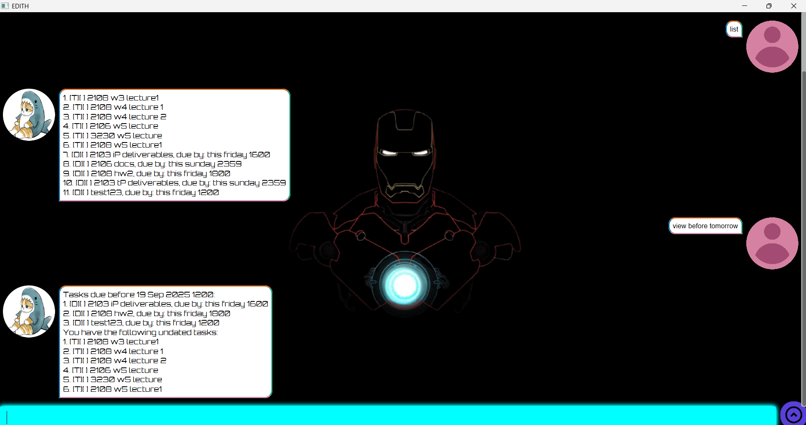

# EDITH User Guide

// 

> "even dead im the hero" - iron man 2021

Welcome to Edith! Keep track of your tasks, deadlines and events, all while having a cool background :)

# Feature List

### Adding tasks

There are 3 kinds of tasks you can add:
1. todo: undated task
      - eg: `todo plan dec trip`
2. deadline: add a due by date using '/by'
   - eg: `deadline hw1 /by this friday 2359`
3. event: add a start and end using '/from' and 'to'
   - eg: `event lecture /from tomorrow 1200 /to 1400`

Notes on datetime input:
- the time field is always optional, and always 24hrs
- you can use dd/MM/yyyy HHmm, eg '25/12/2025 2359'
- OR you can use relatives, limited to today, tomorrow, this (day) and next (day)

### Viewing tasks

You can use command `list` or `ls` to see all tasks:
```
1. [T][ ] task 1
2. [D][ ] deadline1, due by: this friday 1600
...
```

### Searching for tasks
You can use command `find` to see all tasks:

Example: `find lecture`
```
2. [T][ ] 2108 w4 lecture 1
3. [T][ ] 2108 w4 lecture 2
4. [D][ ] 2108 lecture notes, due by: this friday 1200
...
```

### Checking your schedule

You can also see which tasks are due on/before a certain date!

Example: `view for tomorrow`

You'll see everything due tomorrow and any events happening. Undated tasks will appear at the bottom.

```
Tasks due for 19 Sep 2025 1200:
1. [D][ ] task1, due by: this friday 1600
2. [D][ ] task2, due by: this friday 1800
...
You have the following undated tasks:
1. [T][ ] task3
2. [T][ ] task4
3. [T][ ] task5
...
```

If you want to see everything due before a date instead of specifically on that date, use `view before` instead of `view for`. 

### Marking and Unmarking

If you want to leave tasks in the list but mark them as done, you can use `mark` (and `unmark` to set them back to undone). 
Use index of the task to indicate which task to mark or unmark.

Example: `mark 1`

will leave the first task still in the list but marked done:

```
good job buddy you finished task:
[T][X] task1
```
and `unmark 1` will reset it to undone:
```
alright then we reopening task:
[T][ ] task1
```

### Deleting Tasks

To remove tasks, use the `delete` or `del` command. Use index of the task to indicate which task to mark or unmark.

Example: `del 1`

will delete the first task:

```
okay we removed:
[T][ ] task1
you have 1 tasks left
```

### Help page

If you need to see the list of commands, use `help`. It will print to screen a list of acceptable commands.

# Data Storage and Saving

Data is stored in a .txt file called output.txt. There is no need
to save manually.

Users are welcome to edit output.txt, but note that formatting issues
will result in the task list being reinitialised on running
Edith again.

# Command Summary
- [Adding tasks](#adding-tasks)
- [Visualising tasks](#viewing-tasks)
- [Finding tasks](#searching-for-tasks)
- [Viewing schedule](#checking-your-schedule)
- [Mark and Unmark](#marking-and-unmarking)
- [Deleting tasks](#deleting-tasks)
- [Help](#deleting-tasks)


jiayous and enjoy~~